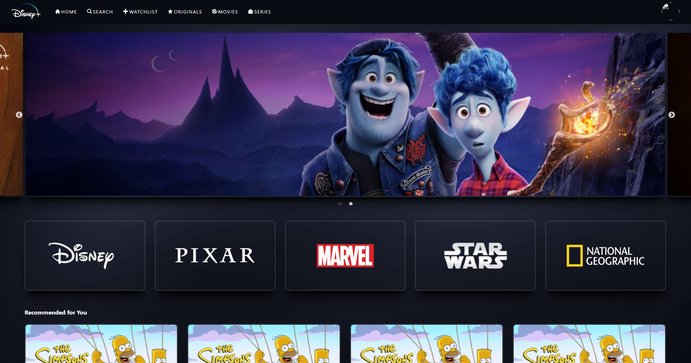

# Hotstar UI Project


## Table of Contents

- [Introduction](#introduction)
- [Features](#features)
- [Demo](#demo)
- [Installation](#installation)
- [Usage](#usage)
- [Contributing](#contributing)
- [License](#license)

## Introduction

Welcome to the Hotstar UI Project! This project aims to recreate the user interface of Hotstar, providing an immersive streaming experience. The project utilizes [list of technologies/tools], and our goal is to [mention the overarching goal or purpose of the project].

## Features

- **Responsive UI:** A user-friendly and responsive design for seamless viewing on various devices.
- **Content Navigation:** Intuitive navigation through a vast library of content.
- **Search Functionality:** Quick and efficient search feature to find your favorite shows and movies.
- **User Authentication:** Secure user authentication to personalize the viewing experience.

## Demo

Check out the live demo [here](link/to/demo) or view the screenshots below:




## Installation

Follow these steps to set up the Hotstar UI project locally:

1. Clone the repository:

    ```bash
    git clone https://github.com/your-username/hotstar-ui-project.git
    ```

2. Navigate to the project folder:

    ```bash
    cd hotstar-ui-project
    ```

3. Install dependencies:

    ```bash
    npm install
    ```

## Usage

To run the Hotstar UI project locally, use the following command:

```bash
npm start
